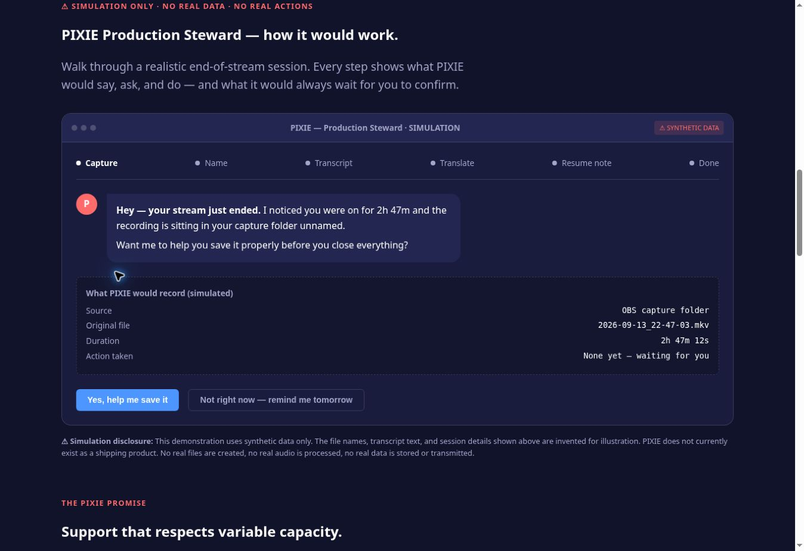
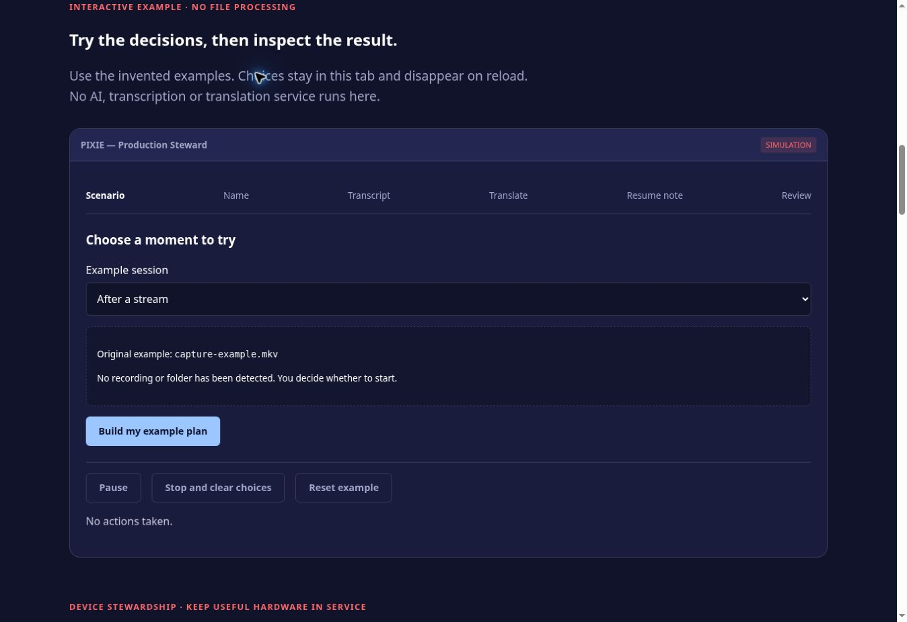

# PIXIE example review — October 4, 2026

1. **Enter the original demo — clear visual structure, misleading premise.** The disclosure was visible, but the script implied it had detected a real folder and stream.
2. **Decline / edit / skip — failed behavior in the original.** Browser observation confirmed “Not right now” advanced to naming. The source made the name readonly and treated both options identically. Completion copy claimed transcript/translation/note results regardless of the chosen branch.
3. **Try the revised example — browser checks passed.** Editable scenarios, real stop/pause states, dependent skips, review and confirmation now match the visitor's choices.
4. **Give feedback / explore hardware / choose Streamplace — working preview and routing.** Feedback is reviewable before manual sharing. Hardware sources distinguish device families. Streamplace is optional and removable. Export completion, actual stream playback and physical-device accessibility remain unverified.

Before, at the start of the flow:

After, at the start of the flow:

The revised view preserves the site's navy/coral design and panel structure. Controls use visible focus styles and 44px minimum targets. Screenshots do not establish screen-reader conformance. The next meaningful test is iPad Safari/VoiceOver with a music example, skipped steps, changed confirmation, export-to-Files and a feedback draft.

See [design QA and verification limits](../design-qa.md), [ecosystem coordination](ECOSYSTEM-COORDINATION.md), and [hardware pathways](HARDWARE-PATHWAYS.md).
